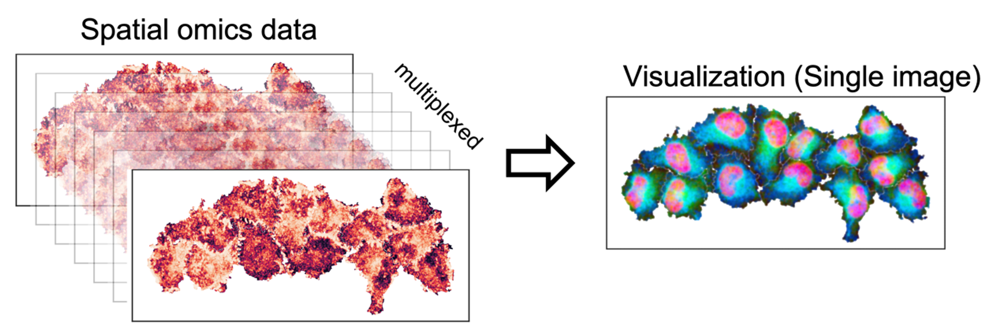

## Overall

 SOView can visualize tissue structures for spatial omics data.

 Find installation and tutorial in the [**Tutorial**](https://soview-doc.readthedocs.io/en/latest/index.html)

### Developer: Zhiyuan Yuan (zhiyuan AT fudan DOT edu DOT cn) 
 

## SOView overview

## Cite
 
Yuan, Z., Pan, W., Zhao, X. et al. SODB facilitates comprehensive exploration of spatial omics data. Nat Methods (2023). https://doi.org/10.1038/s41592-023-01773-7

 
Spatial Omics DataBase (SODB): increasing accessibility to spatial omics data. Nat Methods (2023). https://doi.org/10.1038/s41592-023-01772-8
